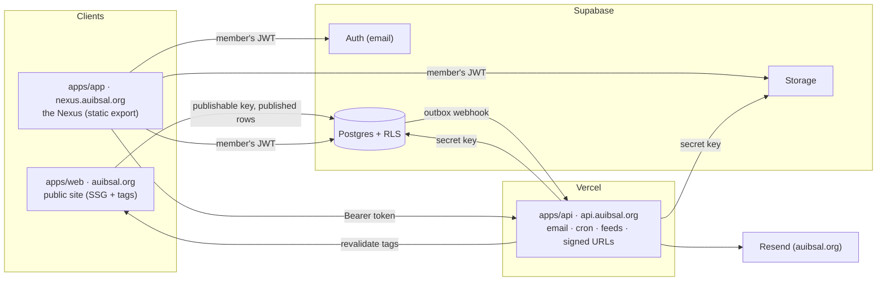

# Architecture and integrations

How the SAL platform fits together, and how to set up each integration.
`AGENTS.md` has the rules in short; `PROGRESS.md` has the state of the build.

## Architecture at a glance



### Principles

1. **Row Level Security is the boundary.** The Nexus queries Postgres with the
   member's token; the public site with the publishable key. Policies decide
   what each can read and write. Every policy calls
   `access.has_permission(permission, scope_type, scope_id)`.
2. **Secrets live in `apps/api` (and CI), nowhere else.** The Nexus is a
   static export whose bundle anyone can read. When it needs a privileged
   action it calls `apps/api`, which verifies the JWT (`authenticateRequest`)
   and re-checks the permission (`hasPermission`) before using the admin client.
3. **Multi-step rules are Postgres functions.** RSVPs and waitlist promotion,
   check-ins, Journal transitions and decisions, ledger sign-off, spending
   approvals, ballots and the ranked-choice count are `SECURITY DEFINER`
   functions with `search_path = ''`, called by RPC.
4. **Side effects go through an outbox.** Functions and triggers write to
   `core.outbox` in the same transaction (emails to send, cache tags to
   revalidate). A Supabase database webhook on insert hands each row to
   `apps/api`, which sends the mail or calls `apps/web`'s revalidation route.
5. **One session across subdomains.** Auth cookies are set on `.auibsal.org`
   (`NEXT_PUBLIC_AUTH_COOKIE_DOMAIN`), so signing in on the Nexus also signs
   the visitor in for the public site's member-aware bits.

## Data model

Schemas (all exposed to the Data API, all with RLS on every table):

| Schema | Contents |
| --- | --- |
| `core` | profiles, semesters, blackouts, programmes, settings, activity log, outbox |
| `access` | permissions, roles (with spending limits), role bundles, role assignments, `has_permission`, `assign_role` |
| `membership` | memberships (tiers), pledges (versioned), verification queue, activity records, calendar tokens, `is_voting_member` |
| `events` | events, RSVPs, waitlist, staff, check-ins, cached AUIB campus calendar |
| `journal` | issues, contributors, pieces and their text, calls, submissions, files, blind entries, blind keys, assignments, scores, decisions, agreements, status history |
| `charity` | partners, campaigns, append-only ledger and sign-offs, receipts, impact metrics |
| `programmes` | Side Quest episodes and reels, Six Words, rotas, shifts, removal requests |
| `governance` | Council terms, minutes, resolutions, spending approvals, library, elections, positions, candidates, voters, ballot receipts, ballots, results |
| `content` | pages, news, media, homepage slots, announcements, document search index, `search()` |

Key designs:

- **Blind review.** `journal.submissions` (with the author) is readable by the
  author and `journal.identity.view` holders only. Readers see
  `journal.blind_entries` (no author) through their assignments; the mapping
  is `journal.blind_keys`. `journal.entry_author()` reveals the author only
  after a decision.
- **Ledger.** No update or delete grants for anyone and a trigger that refuses
  them; corrections are reversing entries. `charity.campaign_progress()`
  counts signed-off entries only (the signer is never the recorder).
- **Elections.** `governance.cast_ballot()` writes a receipt (who) and a
  ballot (what) with no shared key, timestamp or order; no client role can
  read ballots. Voters are snapshotted when voting opens. RON is offered on
  uncontested races. Off until `features.elections` is true.
- **Voting Members.** Two activity records in the current or previous
  semester. Check-ins create them; member managers add manual ones with a note.

## Local development

```sh
bun run db:start            # Docker: Postgres, Auth, Storage, REST
bun run db:reset            # re-apply migrations from scratch
bun run db:test             # pgTAP
bun run db:types            # regenerate packages/database/types.ts
```

Change the schema with a new migration (`bun run --cwd packages/database
migration:new <name>`); never edit one that has reached a shared database.
Each new table needs RLS, policies that use `has_permission`, column grants,
indexes on policy columns, and pgTAP tests. Regenerate types and commit them.

## Supabase (production)

1. Link the project: `cd packages/database && bunx supabase link --project-ref <ref>`.
2. Apply migrations: `bunx supabase db push` (CI does this on merge to `main`).
3. **Exposed schemas** (Settings → API): add `core, access, membership, events,
   journal, charity, programmes, governance, content`.
4. **Auth → URL configuration:** site URL `https://nexus.auibsal.org`;
   redirect URLs `https://nexus.auibsal.org/**`, `https://auibsal.org/**`,
   `https://api.auibsal.org/**` and `http://localhost:3000/**`–`3002`.
5. **Auth → Providers:** email on (confirmations on, password min 10, letters
   and digits); phone off.
6. **Auth → SMTP:** Resend (`smtp.resend.com`, port 465, user `resend`,
   password = API key, sender `SAL <hello@auibsal.org>`); bilingual templates.
7. **Database webhook:** on `INSERT` into `core.outbox` → `POST
   https://api.auibsal.org/hooks/outbox` with `Authorization: Bearer
   <DATABASE_WEBHOOK_SECRET>`.
8. **First admin:** after the Founder signs up, run once (SQL editor, as the
   service role): `select access.bootstrap_founder('<email>');`
9. Run the security and performance advisors and fix every finding.

## Vercel

Three projects from this repository (root directory → app):

| Project | Root | Domains |
| --- | --- | --- |
| web | `apps/web` | auibsal.org, www.auibsal.org (redirect) |
| app | `apps/app` | nexus.auibsal.org |
| api | `apps/api` | api.auibsal.org |

Environment variables per project are listed in each app's `.env.example`.
`SUPABASE_SECRET_KEY`, `RESEND_TOKEN`, `CRON_SECRET`,
`DATABASE_WEBHOOK_SECRET` and `REVALIDATE_SECRET` belong to `api` only
(`REVALIDATE_SECRET` also to `web`). CI greps the client bundles for them.

## Email (Resend)

Add `auibsal.org` in Resend, then add its DKIM, SPF and return-path records in
Vercel DNS. `apps/api` sends every email with the `@repo/email` templates (previewed in Storybook, "SAL/Emails"), in
the member's language (both when unknown).
